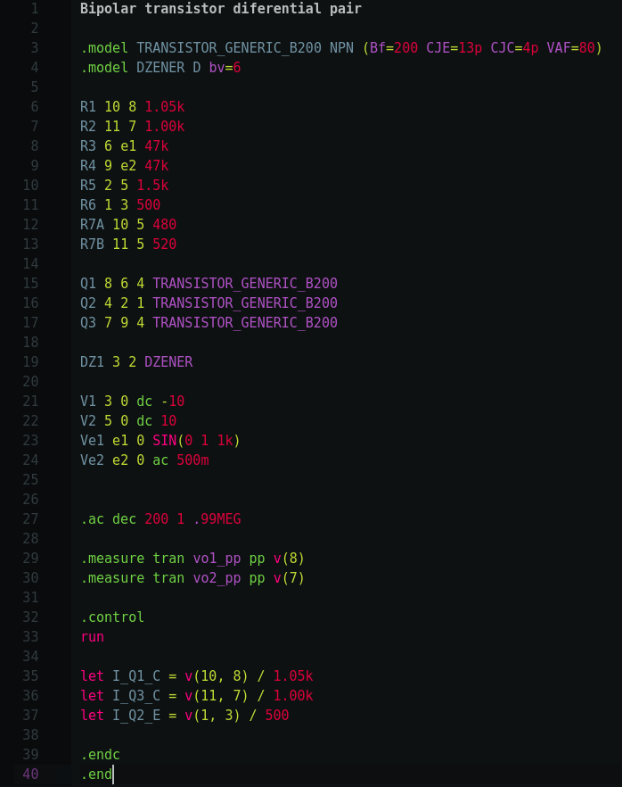

# SPICE language support for Atom Text Editor



This package provides syntax highlighting and snippets for [SPICE](https://en.wikipedia.org/wiki/SPICE) files on Atom Text Editor.

## Installation

This package can be installed with the follow command:

```
apm install language-spice-atom
```
